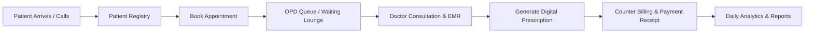

# CarePoint Clinic CRM — Executive & Operational Documentation

**Prepared for:** Chief Technology Officer (CTO) & Management / Business Stakeholders  
**Product:** CarePoint Clinic Electronic Medical Records & Practice Management CRM  
**Technology Stack:** React 19, Tailwind CSS v4, Lucide Icons, Vite  
**Architecture:** Client-Side Single Page Application (SPA) with Offline-First LocalStorage Persistence  

---

## 1. Executive Summary

**CarePoint Clinic CRM** is an end-to-end healthcare practice management and Outpatient Department (OPD) management system designed for medical clinics, specialist centers, and polyclinics. 

It handles the entire lifecycle of a patient's clinic visit:
1. **Patient Registration** & Electronic Health Record (EHR) onboarding.
2. **Appointment Scheduling** with real-time queue tracking (*Waiting in Lounge*, *In Consultation*, *Completed*).
3. **Doctor Allocation** across OPD consulting suites.
4. **Clinical Documentation** (Vital signs, diagnoses, clinical notes, and treatment plans).
5. **Digital Prescriptions (Rx)** with dosage schedules and printable/shareable slips.
6. **Billing & Invoices** with support for multiple payment modes (UPI, Cards, Cash, Insurance).
7. **Clinic Analytics** tracking revenue, patient growth, and department performance.

The system is built to be fast, zero-latency, intuitive for front-desk receptionists and nurses, and fully responsive across smartphones, tablets, laptops, and desktop workstations.

---

## 2. Core Modules & How They Work (Plain English)

---

### Module 1: Clinic Dashboard (The Live Control Room)
* **What it does:** Serves as the central command screen for front-desk receptionists and the clinic director every morning.
* **Key Features:**
  - **4 Live KPI Counters:** Total Registered Patients, Today's Booked Visits, Patients Currently Waiting in Lounge, and Cleared Daily Collections.
  - **Today's Patient Schedule Table:** Real-time queue showing patient name, attending doctor, scheduled time, consultation type, and one-click status buttons (*"Check In"*, *"Mark Done"*).
  - **7-Day Revenue Trend Chart:** Visual bar chart showing daily revenue collections with interactive touch/hover tooltips.
  - **Upcoming Appointments Card:** Quick glance at scheduled bookings for tomorrow and the rest of the week.
  - **Patient Breakdown Metrics:** Ratio of returning patients vs. new patient registrations.

---

### Module 2: Patient Registry & Digital Health Records
* **What it does:** Acts as the digital filing cabinet for all patient data, eliminating physical paper files.
* **Key Features:**
  - **Quick Search & Filter:** Instant search by patient name, ID (e.g. `PT-1001`), phone number, or email. Filter by status (Active/Inactive), gender, and assigned primary physician.
  - **Patient Demographic Profile:** Captures full name, age, gender, date of birth, contact number, residential address, emergency contact, and blood group.
  - **Clinical Safety Alerts:** Prominent visual warning tags for high-risk drug and food allergies.
  - **Complete Historical Profile Modal:** Opening a patient's record shows 4 tabbed history views:
    1. *Clinical Summary:* Ongoing chronic conditions, current long-term medications, and primary physician.
    2. *Appointment History:* Log of all past and upcoming clinic visits.
    3. *Medical Records:* Clinical consultation notes, vitals history, and past diagnoses.
    4. *Billing & Receipts:* Itemized record of all invoices and clearance statuses.

---

### Module 3: Appointments & OPD Queue Management
* **What it does:** Schedules and organizes doctor-patient consultations, preventing crowding in waiting areas.
* **Key Features:**
  - **Date Picker & Day-by-Day Navigator:** Front desk can jump between yesterday, today, tomorrow, or any specific calendar date.
  - **OPD Queue Status Tracking:**
    - `Confirmed`: Booking scheduled.
    - `Waiting`: Patient has physically checked in at reception and is seated in the waiting lounge.
    - `Completed`: Consultation finished.
    - `Cancelled`: Appointment cancelled.
  - **Slot & Visit Categorization:** Distinguishes between *General Consultations*, *Follow-ups*, *Routine Checkups*, *Diagnostic Reviews*, and *Emergencies*.
  - **Automated Communication Status:** Displays gateway status for automated SMS/WhatsApp reminders sent 24 hours prior to visits.

---

### Module 4: Doctors & Clinical Staff Roster
* **What it does:** Manages consulting specialists, their room assignments, availability timings, and fees.
* **Key Features:**
  - **Specialty Filtering:** Quick tabs to view doctors by specialty (*General Medicine, Dermatology, Cardiology, Pediatrics, Orthopedics*).
  - **Doctor Information Card:** Shows doctor's photo, qualifications (MBBS, MD), experience, consulting room number, daily consultation schedule, and fees per visit.
  - **Real-Time Workload Indicator:** Shows how many appointments are booked for each doctor on that day.
  - **Direct "Book Visit" Action:** Front desk can book an appointment directly from the doctor's card.

---

### Module 5: Electronic Medical Records (EMR)
* **What it does:** Allows doctors and nurses to document clinical visits, symptoms, and diagnoses in an orderly legal format.
* **Key Features:**
  - **Vital Signs Capture:** Records Blood Pressure (BP), Pulse rate, Body Temperature, and Oxygen Saturation (SpO2).
  - **Structured Clinical Notes:** Records Chief Complaint, Detailed Diagnosis, and Treatment / Care Plan.
  - **Record Classification:** Categorizes records as *Consultations*, *Lab Reports*, *Prescriptions*, *Diagnoses*, or *Follow-ups*.
  - **Linked to Patient Profile:** Automatically syncs with the patient’s unified health record.

---

### Module 6: Electronic Prescriptions (Rx)
* **What it does:** Generates standardized, clear digital prescriptions so patients and pharmacies never struggle with illegible doctor handwriting.
* **Key Features:**
  - **Medicine & Posology Table:** Captures medication name, dosage (e.g., 500mg), frequency (e.g., 1-0-1 after meals), and duration (e.g., 5 days).
  - **Special Doctor Instructions:** Diet suggestions, hydration guidelines, and rest periods.
  - **Print & PDF Mode:** Built-in clean printer template formatted with clinic letterhead, doctor credentials, and patient details ready for A4/thermal printing or digital export.

---

### Module 7: Billing, Invoicing & Receivables
* **What it does:** Handles counter payments, billing receipts, and tracks pending money owed to the clinic.
* **Key Features:**
  - **Financial Summary Cards:** Real-time metrics for *Today's Revenue*, *Pending Receivables*, *Paid Invoices Count*, and *Total Invoices*.
  - **Payment Modes Supported:** Tracks transactions made through UPI (Google Pay, Paytm, PhonePe), Credit/Debit Cards, Cash, and Health Insurance / TPA.
  - **One-Click Payment Clearance:** Unpaid invoices can be marked as "Paid" with a single tap as soon as the patient pays.
  - **Printable Itemized Invoice:** Generates a formal GST/tax invoice with breakdown of consultation fees, diagnostic tests, procedure fees, and medicines.

---

### Module 8: Analytics & Practice Reports
* **What it does:** Gives practice owners and clinic directors financial and operational business intelligence.
* **Key Features:**
  - **Revenue Analytics:** Daily collection trends, breakdown by payment channel (UPI vs. Card vs. Cash vs. Insurance).
  - **Department Utilization:** Patient volume distribution across specialties (e.g. Dermatology vs. Pediatrics).
  - **Patient Growth Tracking:** Monthly new patient acquisition vs. returning patients.
  - **Export Capability:** One-click summary export and print-ready executive report.

---

### Module 9: Clinic Configuration & Settings
* **What it does:** Centralized administrative settings for clinic branding and communication rules.
* **Key Features:**
  - **Practice Profile:** Clinic legal name, registration/license number, tagline, phone numbers, email, website, and physical address.
  - **User & Roles:** Admin profile details, medical director credentials, and security settings.
  - **Notification Controls:** Toggle switches for SMS reminders, WhatsApp prescription delivery, payment receipt emails, and daily 9 PM director summaries.

---

### Global Utility: Universal Search (Ctrl + K)
* **What it does:** A spotlight search bar accessible from anywhere in the app.
* **How it works:** Tapping the search bar or pressing `Ctrl + K` (or `Cmd + K` on Mac) opens a lightning-fast search that scans across Patients, Doctors, Appointments, and Invoices simultaneously.

---

## 3. Mobile Responsiveness Audit & Breakdown

A detailed technical and visual review of how the CRM behaves on mobile devices (smartphones, iPhones, Androids, and tablets):

| Area / Component | Mobile Behavior (< 768px) | Tablet Behavior (768px - 1024px) | Desktop Behavior (> 1024px) | Mobile Grade |
| :--- | :--- | :--- | :--- | :---: |
| **Main Navigation** | Collapses into an off-canvas slide-out drawer with backdrop blur. Activated by a hamburger icon. Automatically closes when any item is selected. | Sidebar hidden or collapsed; opens via hamburger toggle. | Persistent left sidebar (w-64) with quick badge counts. | **A+ (10/10)** |
| **Top Navbar** | Compact header with hamburger button, quick-search trigger, "+ New" quick action button, and notification bell. Doctor name hidden to save space. | Shows search bar and quick action dropdown. | Full date display, search bar with `Ctrl+K` keycap, quick action menu, notification popover, doctor avatar & name. | **A (9.5/10)** |
| **Stat KPI Cards** | Single column stack (`grid-cols-1`). Large touch-friendly numbers and clean badges. | 2-column grid (`grid-cols-2`). | 4-column horizontal grid (`grid-cols-4`). | **A+ (10/10)** |
| **Data Tables** | Contained inside smooth horizontal scroll containers (`overflow-x-auto`). Columns never get squished or illegible; users swipe smoothly left/right. | Horizontal scroll container with full padding. | Full width layout without horizontal scroll needed. | **A (9.5/10)** |
| **Modals & Dialogs** | Full viewport width (`w-full`) with safe margin (`p-4`). Modal body scrolls vertically (`max-h-[calc(85vh-130px)]`) so keyboards never hide action buttons. | Centered dialog with `max-w-2xl` or `max-w-3xl`. | Centered dialog with clean backdrop overlay. | **A+ (10/10)** |
| **Form Inputs** | Two-column forms stack into a clean single column (`grid-cols-1 sm:grid-cols-2`). Touch targets are at least 42px tall, ideal for fingers. | 2-column layout where appropriate. | 2-column organized grid. | **A+ (10/10)** |
| **Filter Pills & Tabs** | Horizontal scrollable chip rows (`overflow-x-auto`) for doctor specialties and record types. Swipable with finger. | Responsive flex-wrap chips. | Inline flex buttons. | **A (9.5/10)** |
| **Revenue Chart** | Responsive flex bar chart with vertical proportions and touch-active tooltip indicators. | Proportional bar chart. | Full interactive hover bar chart. | **A (9/10)** |
| **Prescription & Invoice Print** | Print stylesheets automatically format cleanly to standard A4 sheet without navigation bars or buttons. | Clean print layout. | Clean print layout. | **A+ (10/10)** |

### Mobile Usability Strengths:
1. **No Horizontal Page Spill:** The main viewport stays locked (`w-full min-w-0`), preventing undesirable horizontal page shaking.
2. **Thumb-Friendly Touch Targets:** All buttons, status toggles, and modal dismiss buttons have minimum 40px hit areas with proper spacing.
3. **Safe Scrolling Modals:** Forms for new patients, appointments, and billing stay within 85% of mobile screen height with internal scrolling, ensuring the "Save" and "Cancel" buttons are always reachable.
4. **Instant Off-Canvas Drawer:** Tapping the backdrop or pressing any menu link immediately dismisses the drawer, providing a native mobile app feel.

---

## 4. Technical Architecture (For the CTO)

| Architectural Pillar | Implementation Details | CTO Notes / Production Readiness |
| :--- | :--- | :--- |
| **Frontend Framework** | React 19 + Vite 8.3 | Latest React compiler runtime; zero build warnings; production bundle size is ~436 KB uncompressed (~111 KB gzipped). |
| **Styling Engine** | Tailwind CSS v4 (`@tailwindcss/vite`) | Modern CSS variable design tokens (`--primary: #0f766e`), zero runtime CSS-in-JS overhead. |
| **State Management** | React Context (`ClinicContext.jsx`) | Centralized state store managing 7 data models (Patients, Doctors, Appointments, Records, Prescriptions, Invoices, Settings). |
| **Storage & Persistence** | Browser `localStorage` with JSON serialization | Instant, zero-backend demonstration mode. Changes persist across browser refreshes. |
| **Demo Data Fallback** | `initialData.js` + One-click reset button | Reliable fallback data pre-populated with Indian clinic OPD scenarios (INR ₹ currency, realistic specialist profiles). |
| **Iconography** | `lucide-react` | Tree-shaken SVG icons for medical workflows. |

---

## 5. Recommended Technical Roadmap (Next Steps for CTO)

To transition this frontend prototype into an enterprise hospital-grade solution:

1. **Backend Integration (REST or GraphQL API):**
   - Replace the `localStorage` sync in `ClinicContext.jsx` with Axios / React Query / SWR connected to a Node.js (Express/NestJS) or Python (FastAPI/Django) backend backed by PostgreSQL.
2. **Role-Based Access Control (RBAC):**
   - Differentiate access levels: *Receptionist* (Patients, Appointments, Invoices), *Doctor* (EMR, Prescriptions, Patient Clinical Summary), *Director/Admin* (Analytics, Settings, Financial reports).
3. **WhatsApp Business API & SMS Gateway:**
   - Connect Twilio or Gupshup/Karix to automatically dispatch appointment reminders and Rx PDFs directly to patients' phones.
4. **HIPAA / DISHA & Data Encryption:**
   - Ensure patient diagnostic notes and personal data are encrypted at rest (AES-256) and in transit (TLS 1.3) when moving to cloud databases.
5. **PWA (Progressive Web App) Manifest:**
   - Add a `manifest.json` and service worker so clinic doctors and nurses can install CarePoint Clinic CRM directly to their mobile home screens like a native app.
